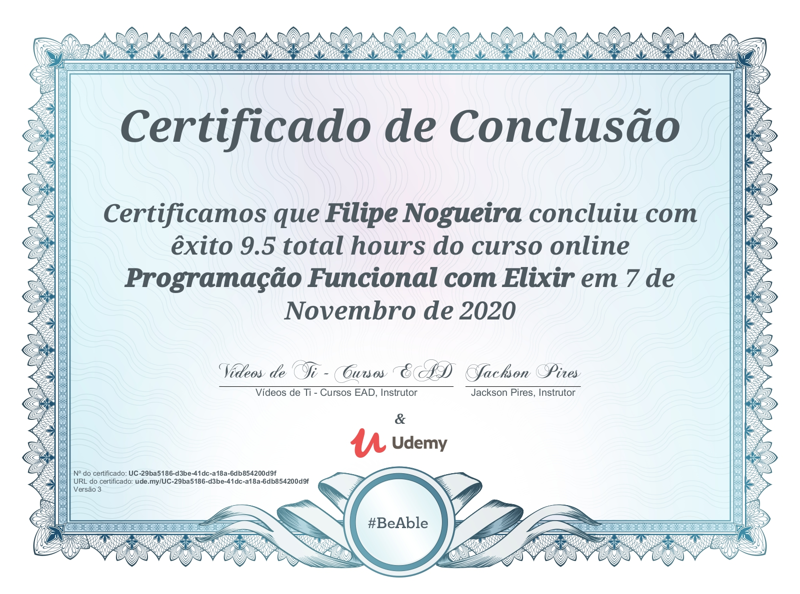

# Filipe Nogueira 

Desenvolvedor Junior - Em busca de uma oportunidade 

:house:    Vila Velha/Es  
:iphone:   (27) 99792 - 5394  
:envelope:  nog.lipe@gmail.com
[Linkedin](https://www.linkedin.com/in/filipe-nogueira-souza/)

Meu nome é Filipe Nogueira de Souza, sou apaixonado por desenvolvimento e com a possibilidade que a tecnologia nos traz de criar soluções para os diversos tipos de problemas. 

## Conhecimento

### Linguagens
* Python
* Elixir
* JavaScript

### Sistemas Operacionais
* Linux
* Windows

### Front-end
* HTML
* CSS
* BOOTSTRAP

### Frameworks
* Django

### CMS
* JOOMLA
* WORDPRESS

### Sistemas de controle de versão
* Git

## Formação
* Análise e Desenvolvimento de Sistemas (ESTÁCIO) - Incompleto

## Certificados

-------------------------------------
#### Certificados

##### [Programação Funciona com Elixir](https://www.udemy.com/course/programacao-funcional-com-elixir)

#### Erro?
Achou algum erro ou faltou alguma informação. Ajude-me a melhorar enviando um e-mail para nog.lipe@gmail.com
