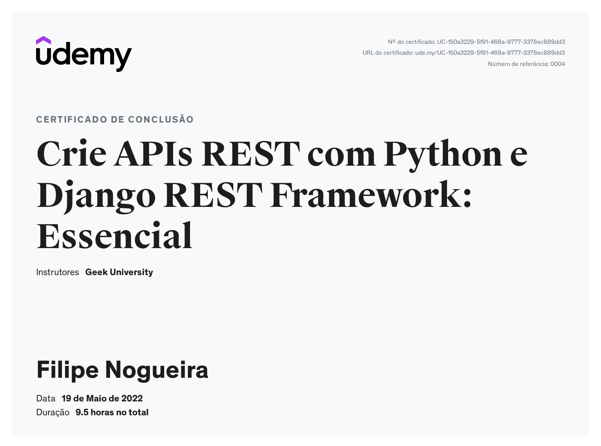
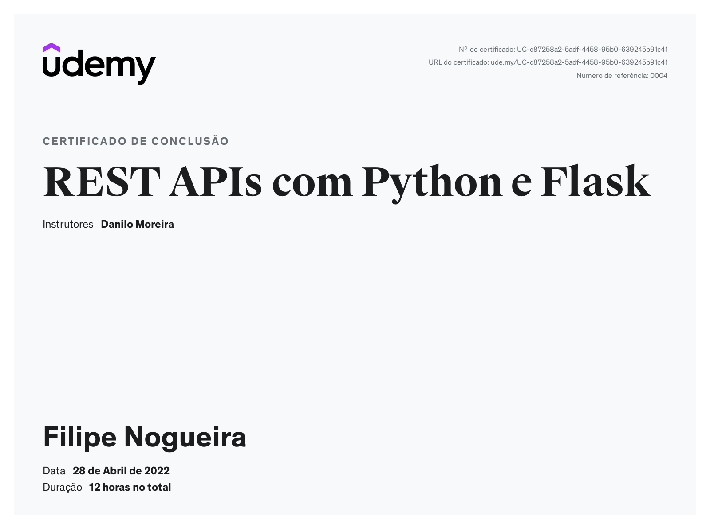

# Filipe Nogueira 
Desenvolvedor FullStack - Python / React

:house:    Vila Velha/Es  
:iphone:   (27) 99792 - 5394  
:envelope:  nog.lipe@gmail.com
[Linkedin](https://www.linkedin.com/in/filipe-nogueira-souza/)

Meu nome é Filipe Nogueira. Desenvolvi meu interesse por programação enquanto trabalhava em funções administrativas nas empresas anteriores. Ao longo desse tempo, passei a utilizar programação para automatizar processos, otimizar fluxos e contabilizar dados, sempre com foco em praticidade e objetividade. Esse interesse evoluiu, e atualmente, na empresa em que trabalho, mantenho um sistema financeiro interno desenvolvido integralmente por mim, com uma API em Python com front-end em React e utilizo o S3 da Amazom para armazenamento dos arquivos financeiros como notas fiscais, boletos e outros. Esse sistema, em uso há mais de um ano, é atualizado constantemente com novas funcionalidades e melhorias.

Também desenvolvi ferramentas auxiliares, como geradores de relatórios e automações para monitoramento e extração de dados do sistema da empresa. Esses relatórios e análises são amplamente utilizados, tanto pelo setor jurídico em audiências quanto pela diretoria na tomada de decisões estratégicas.

## Conhecimento

### Linguagens
* Python
* React
* TypeScript

### Sistemas Operacionais
* Linux
* Windows

### Frameworks
* Django
* Next.JS

### CMS
* JOOMLA
* WORDPRESS

### Sistemas de controle de versão
* Git

## Formação
* Análise e Desenvolvimento de Sistemas (ESTÁCIO) - Incompleto

## Certificados

-------------------------------------
#### Certificados

##### [Programação Funciona com Elixir](https://www.udemy.com/course/programacao-funcional-com-elixir)

##### [ Crie APIs REST com Python e Django REST Framework](https://www.udemy.com/certificate/UC-150a3229-5f91-468a-9777-3376ec889dd3/)

##### [ Crie APIs REST com Python e Flask](https://www.udemy.com/certificate/UC-c87258a2-5adf-4458-95b0-639245b91c41/)

#### Erro?
Achou algum erro ou faltou alguma informação. Ajude-me a melhorar enviando um e-mail para nog.lipe@gmail.com
